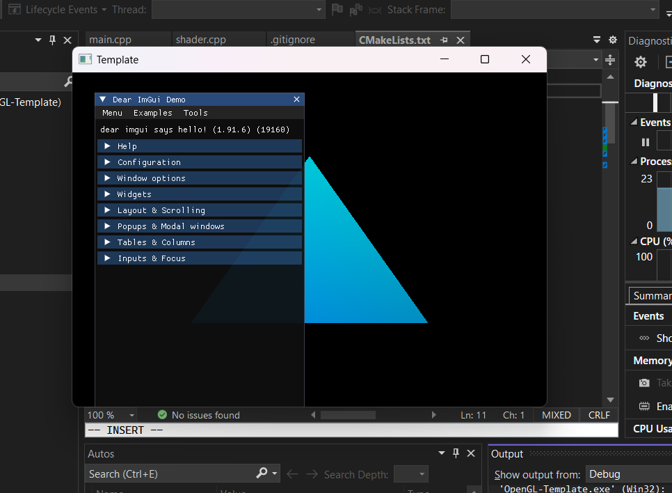

# Template for GLFW/IMGUI/OpenGL3


> For ImGui, using glfw + opengl3 as platform and backend. 
This may not work on all platforms such as Apple M1 so you'll need to change it, but its only a few lines of code.

```
mkdir build
cd build
cmake ..
```
Unix:
```
make
```
Windows. Compile CMakeLists.txt with Visual Studio 2022 Cmake and run the .exe file.
